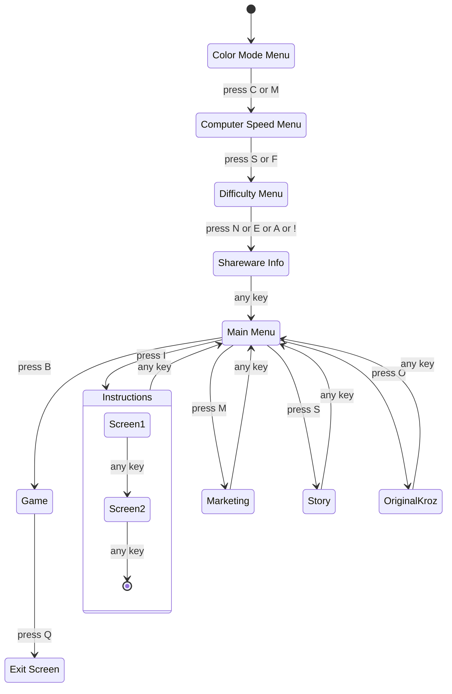

## Quick Start
### Creating a Virtual Environment

Installing packages to a virtual environment allows us to ensure we all use the same version of a package. A virtual environment is an isolated python environment, so if you have an old project with an old version of pygame it won't interfere with this project.

#### MacOS/Linux:
```sh
# create a virtual environment in ./venv
$ python3 -m venv venv
# enter the venv
$ source ./venv/bin/activate
# installs the correct versions of all required packages
$ pip3 install -r requirements.txt
```

#### Windows:
```ps
# create a virtual environment in ./venv
PS> python3 -m venv venv
# enter the venv
PS> .\venv\Scripts\Activate.ps1
# installs the correct versions of all required packages
PS> pip3 install -r requirements.txt
```

To exit, run `deactivate` (same command on all platforms)

## Build Instructions
> [!NOTE]
> Must be in a virtual environment to use the `pyinstaller` command. See [Creating a Virtual Environment](#creating-a-virtual-environment) for info
```sh
$ pyinstaller main.spec --noconfirm
```

Using the above command will build an executable for your platform and place it in the `./dist` folder.

---

## Game State
Internally switching between game states (e.g., main menu, instruction screen, game) is handled by a state machine. This closely matches the internal flow of the original Pascal code.


